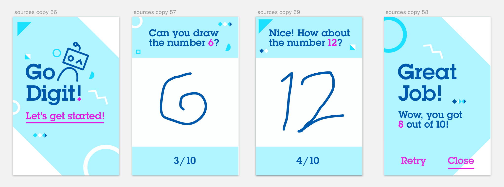

# go-digits
iOS sample application that teaches little kids to write digits.

  

## Requirements
- Xcode 9
- iOS 11

## Usage
To use this app, open **go-digits.xcodeproj** in Xcode 9.
Next build and run it on a device or simulator with iOS 11.
