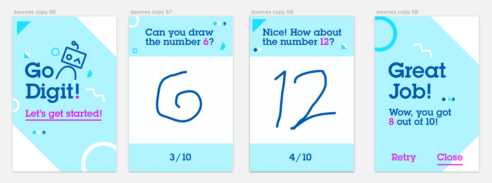

# From Neural Network Modeler to iOS application

This tutorial shows how to design convolutional neural network with Neural Network Modeler (part of Watson Studio), train it using GPU cluster, deploy and finally make part of an iOS sample application.

  

## Requirements
- **Watson Studio** with deep learning capabilities
- Xcode 9

## Deep learning model design and training

### Neural Network Modeler flow
1. In Watson Studio project add new Modeler flow. Import this [sample flow](https://dataplatform.ibm.com/docs/content/analyze-data/ml-canvas-nnd-mnist-tutorial.html?audience=wdp&context=analytics
) for hand written digits recognition (MNIST) using  `From file` option.

2. Upload train/test/validate data sets to your Cloud Object Storage. Data sets can be found [here.](https://github.com/pmservice/wml-sample-models/tree/master/keras/mnist/data)

3. Open `Image Data` node details and specify you COS details (with uploaded files).

4. `Publish Training Definition` using up-arrow button (top right corner of flow editor).

5. Click `train it in an experiment` link to switch to experiment studio.

### Model training via Experiment Studio

1. Define experiment details such as:
  - name
  - select COS with training data
  - select existing training definition (the one publish from the flow editor) and compute plan

2. Trigger model training process by pressing `Create and run` button.

3. You can monitor your training progress by clicking the training run name and next in run details `Logs` tab.

4. When training is completed you can store trained model in repository by choosing from Action menu `Store model` (Completed runs section).

## Trained model deployment as Core ML
1. Open stored model details (click on model name under Models section).

2. In `Deployments` tab `(+) Add Deployment`

3. Select deployment type as `virtual` and format as `Core ML`

4. Specify the following parameters:
 - `image_input_names` with value `'input1'`
 - `image_scale` with value `0,003921568627451`

5. Create Deployment

## Core ML model integration with sample application

1. In deployment details you can find `download_url` that allows to get Core ML content of Deployment. Download the Core ML model.

2. Clone the following [sample application swift project](https://github.com/pmservice/go-digits) from github.

3. Open **Go-Digits.xcodeproj** in Xcode 9.

4. Add Core ML model to the project. Rename it to `mnistCNN.mlmodel`

5. Next build application and run it on a device or simulator with iOS 11.

  

